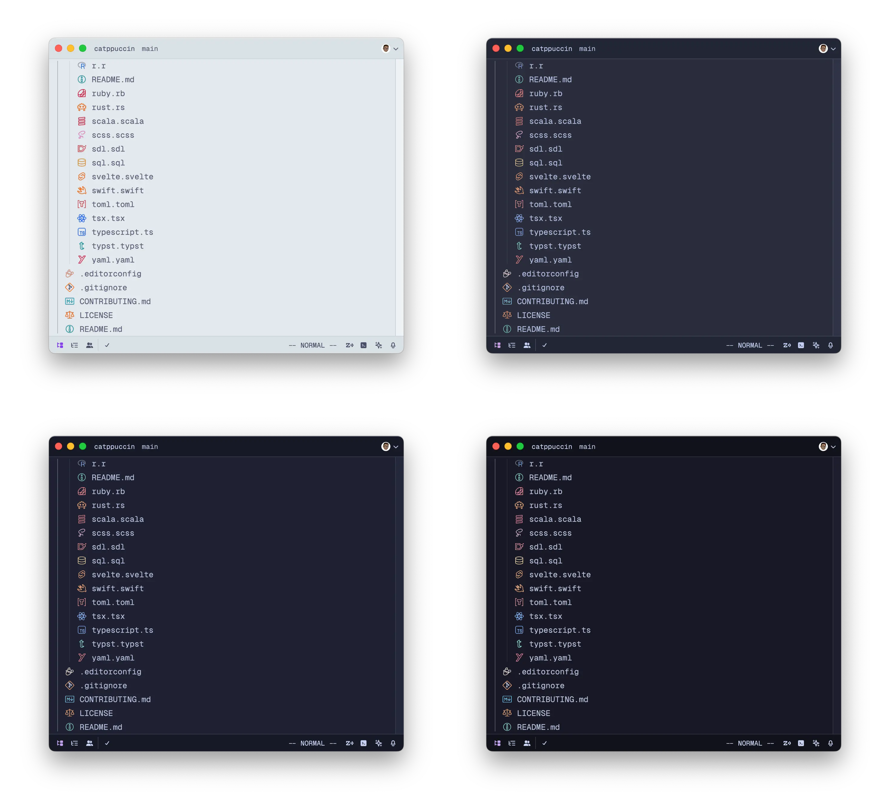
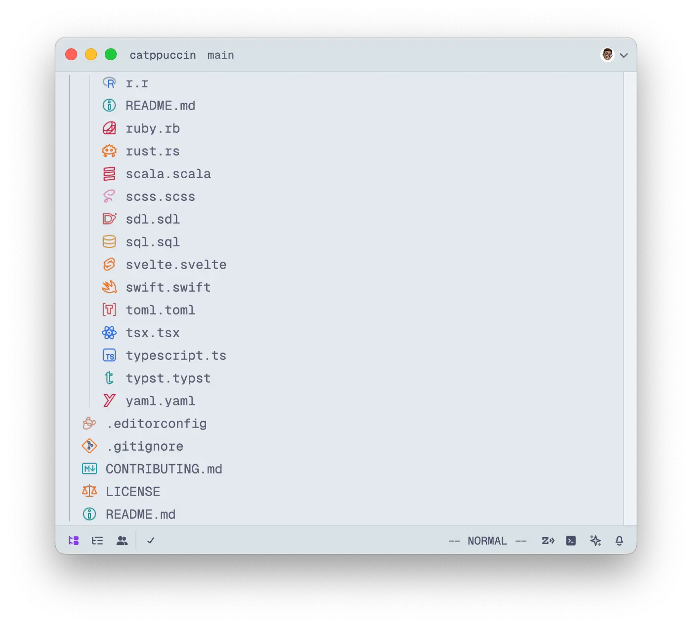
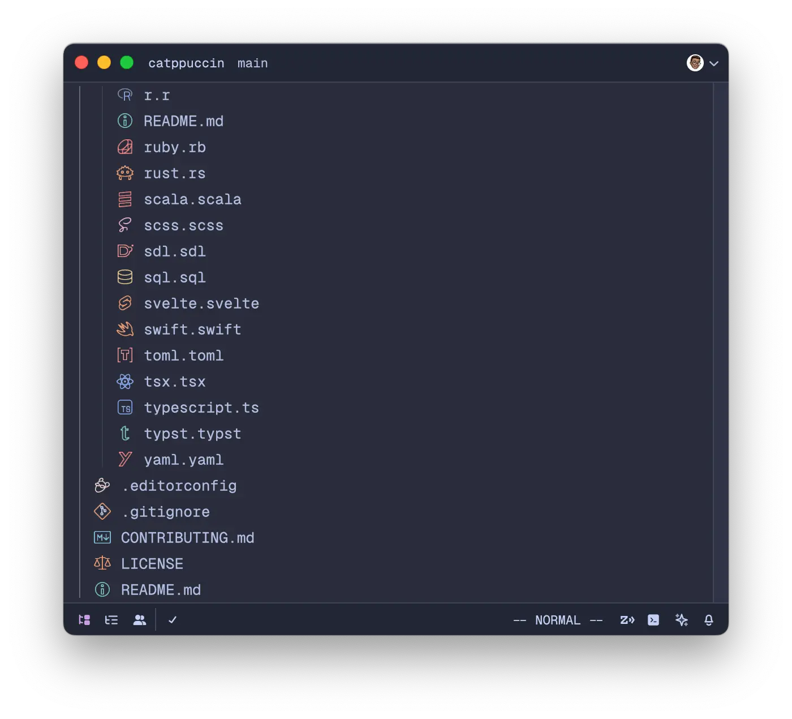
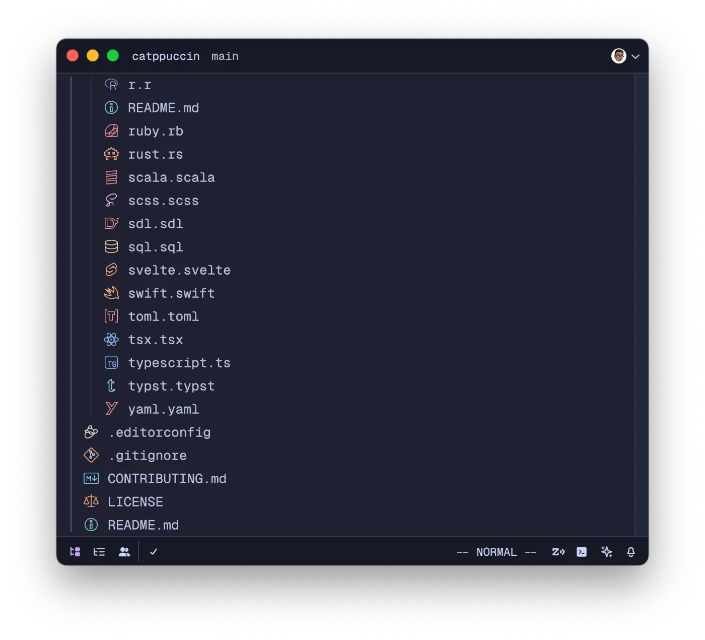
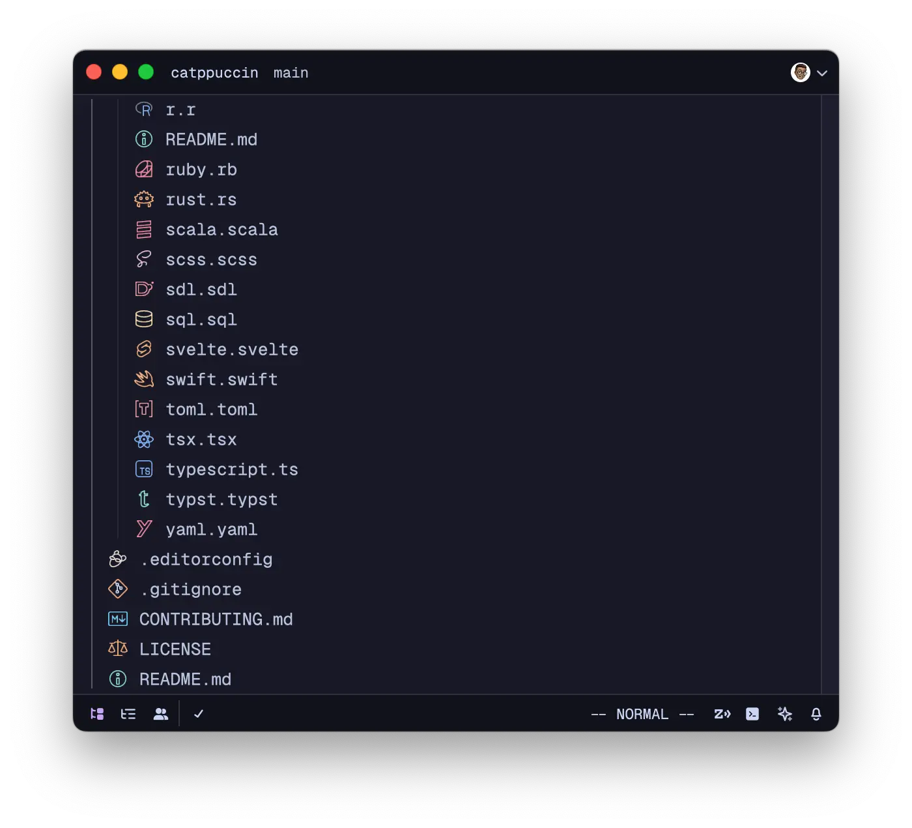

<h3 align="center">
	 
	
	Catppuccin Icons for <a href="https://zed.dev/">Zed</a>
	
</h3>

	
	
	

	

## Previews

🌻 Latte

🪴 Frappé

🌺 Macchiato

🌿 Mocha

## Usage

1. Open Zed.
2. Open the command palette (<kbd>Cmd</kbd>+<kbd>Shift</kbd>+<kbd>P</kbd>) and enter _zed: extensions_.
3. Search for the _Catppuccin Icons_ extension and install.
4. Enter _theme selector: toggle_ in the command palette and select the Catppuccin Icons theme in your preferred flavor in the dropdown.

## Development

### JSON Template Generation

Install [Whiskers](https://github.com/catppuccin/whiskers), Catppuccin's in-house theme generator, to build and test themes locally.

Once installed, run `whiskers zed.tera` to generate all JSON template in the `icon_themes/` directory.

## Icon Generation

TODO

### Publishing to the Marketplace

See the [Zed documentation](https://zed.dev/docs/extensions/developing-extensions#updating-an-extension) for more information.

## 💝 Thanks to

- [tecandrew](https://github.com/tecandrew)

&nbsp;

	

	Copyright &copy; 2021-present <a href="https://github.com/catppuccin" target="_blank">Catppuccin Org</a>

	

